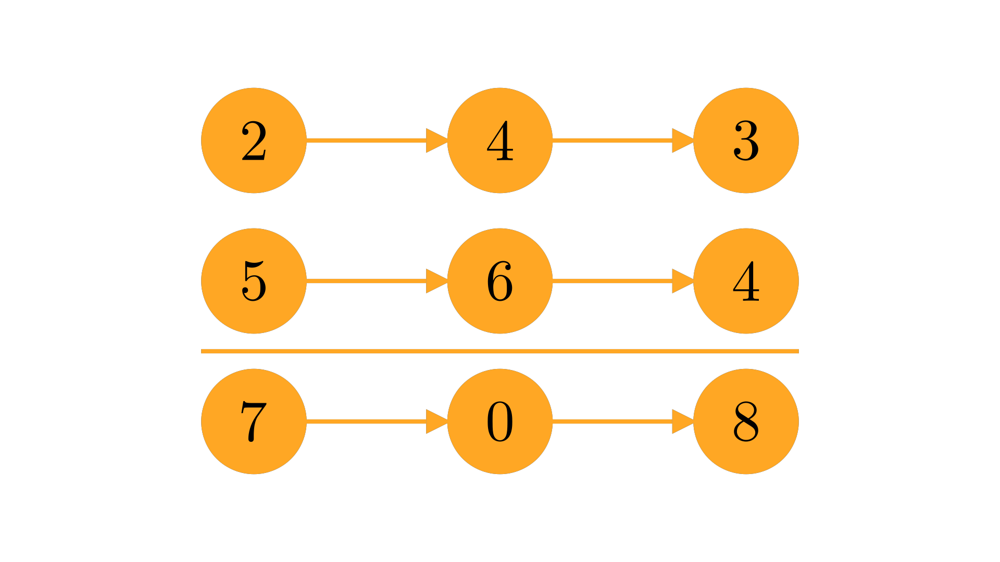

---
tags:
    - DIF:中等
    - 链表
    - 数学
---
# 2. 两数相加

给定两个非空链表分别表示两个非负整数，数字以倒序存储，而链表中的每一个节点存储一个数字。将两数相加并以链表返回两数之和。

你可以假定两个数字都不以 0 开头（除 0 本身以外）。

=== "样例 1"

    

    <pre>
    <code><b>输入：</b>l1 = [2,4,3], l2 = [5,6,4]
    <b>输出：</b>[7,0,8]
    <b>解释：</b>342 + 465 = 807.</code>
    </pre>

=== "样例 2"

    <pre>
    <code><b>输入：</b>l1 = [0], l2 = [0]
    <b>输出：</b>[0]</code>
    </pre>

=== "样例 3"

    <pre>
    <code><b>输入：</b>l1 = [9,9,9,9,9,9,9], l2 = [9,9,9,9]
    <b>输出：</b>[8,9,9,9,0,0,0,1]</code>
    </pre>

=== "限制条件"

    - 每个链表所包含的节点数量范围是 `[1, 100]`；
    - `0 <= Node.val <= 9`；
    - 保证列表表示一个不以 0 开头的数字。

## 解析

## 复杂度分析

- **时间复杂度：** $O(\max(m, n))$，$m$ 和 $n$ 分别代表两个链表长度。需要遍历两个链表的所有节点求和，遍历次数取决于二者中最长的链表。
- **空间复杂度：** $O(\max(m, n))$，$m$ 和 $n$ 分别代表两个链表长度。需要创建一个新的链表存储两数之和，新链表长度取决于二者中最长的链表，最长为 $\max(m, n) + 1$。

## 代码

=== "Python"

    ```python
    # 单向链表定义：
    # class ListNode:
    #     def __init__(self, val=0, next=None):
    #         self.val = val
    #         self.next = next
    def add_two_numbers(l1: Optional[ListNode],
                        l2: Optional[ListNode]) -> Optional[ListNode]:
        # 创建空指针
        head = tail = None
        carry = 0

        # 遍历链表
        while l1 or l2:
            # 获取加数链表当前节点值，求和及进位值
            val_1 = l1.val if l1 else 0
            val_2 = l2.val if l2 else 0
            carry, res = divmod(val_1 + val_2 + carry, 10)

            # 如果头指针为空，创建结果链表，并存储计算结果
            if not head:
                head = tail = ListNode(res)
            # 否则，链表后添加新节点，存储计算结果，并移动尾指针到新节点
            else:
                tail.next = ListNode(res)
                tail = tail.next

            # 移动加数指针
            l1 = l1.next if l1 else None
            l2 = l2.next if l2 else None
        # 将进位追加到结果链表
        if carry:
            tail.next = ListNode(carry)
        
        return head
    ```

=== "C++"

    ```cpp
    /**
    * 单向链表定义：
    * struct ListNode {
    *     int val;
    *     ListNode *next;
    *     ListNode() : val(0), next(nullptr) {}
    *     ListNode(int x) : val(x), next(nullptr) {}
    *     ListNode(int x, ListNode *next) : val(x), next(next) {}
    * };
    */
    ListNode* add_two_numbers(ListNode* l1, ListNode* l2) {
        ListNode *head = nullptr, *tail = nullptr;
        int carry = 0;

        while (l1 || l2) {
            int val_1 = l1 ? l1->val : 0;
            int val_2 = l2 ? l2->val : 0;
            int sum = val_1 + val_2;

            if (!head) {
                head = tail = new ListNode(sum % 10);
            } else {
                tail->next = new ListNode(sum % 10);
                tail = tail->next;
            }
            carry = sum / 10;

            if (l1) {
                l1 = l1->next;
            }
            if (l2) {
                l2 = l2->next;
            }
        }
        if (carry) {
            tail->next = new ListNode(carry);
        }

        return head;
    }
    ```
